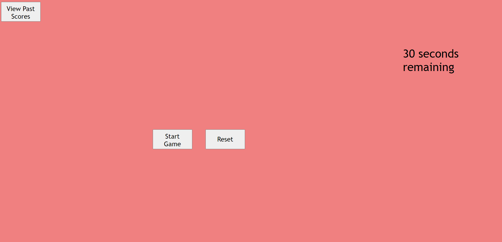

# Multiple_Choice_Quiz

This quiz app has:

A list of questions and answers.

Scores to the local history.

Has a button to display the scores.

A timer that subtracts time if the question answered is wrong.

A history of past attempts and scores.

https://github.com/JasonGabs/Multiple_Choice_Quiz

<<<<<<< HEAD

=======

>>>>>>> eff1e1c34f8bae1cffc69594bffb6e78b49d0ab3
